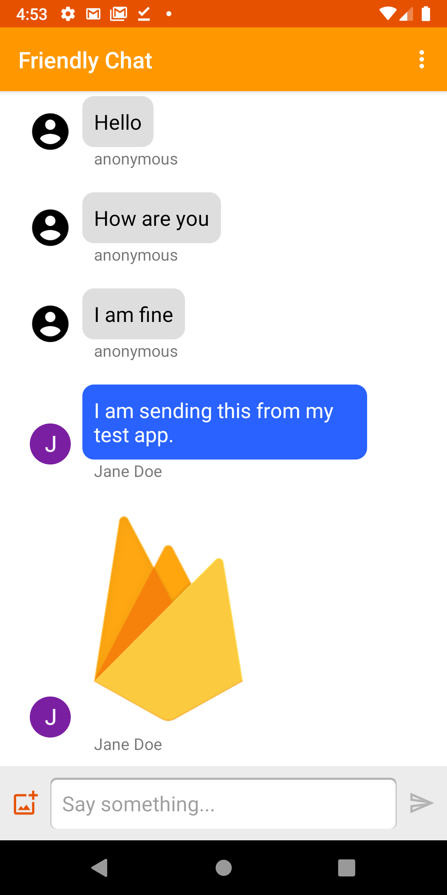

# Firebase Android Codelab - Build Friendly Chat

[Codelab Feedback](https://github.com/firebase/codelab-friendlychat-android/issues)


## Overview
Duration: 05:00



Image: Working Friendly Chat app.

Welcome to the Friendly Chat codelab. In this codelab, you'll learn how to use the Firebase platform to create a chat app on Android.

#### What you'll learn

* How to use Firebase Authentication to allow users to sign in.
* How to sync data using the Firebase Realtime Database.
* How to store binary files in Cloud Storage for Firebase.
* How to use the Firebase Local Emulator Suite to develop an Android app with Firebase.

#### What you'll need

* [Android Studio](https://developer.android.com/studio) version 4.2+.
* An [Android Emulator](https://developer.android.com/studio/run/emulator#install) with Android 5.0+.
* Node.js version 10 or higher (to use the Emulator Suite).
* Java 8 or higher. To install Java use these [instructions](https://java.com/en/download/help/download_options.xml); to check your version, run `java -version`.
* Familiarity with the Kotlin programming language.

## Get the sample code
Duration: 05:00

### Clone the repository

Clone the GitHub repository from the command line:

```console
$ git clone https://github.com/firebase/codelab-friendlychat-android
```

> aside positive
>
> The "friendlychat-android" repository contains two directories:
>
> *  **build-android-start**—Starting code that you build upon in this codelab.
> *  **build-android**—Completed code for the finished sample app.
>
> **Note**: If you want to run the finished app, you have to create a Firebase project in the Firebase console, along with a Firebase Android App that has your app's package name and SHA1. For more information, see [Step #10](https://codelabs.developers.google.com/codelabs/firebase-android/#9) of this codelab.


### Import into Android Studio

In Android Studio, select **File** > **Open**, then select the `build-android-start` directory ( ) from the directory where you downloaded the sample code.

You should now have the `build-android-start` project open in Android Studio. If you see a warning about a `google-services.json` file missing, don't worry. It will be added in a later step.


### Check dependencies

In this codelab all of the dependencies you will need have already been added for you, but it's important to understand how to add the Firebase SDK to your app:

**build.gradle**

```groovy
buildscript {
    // ...

    dependencies {
        classpath 'com.android.tools.build:gradle:7.2.2'

        // The google-services plugin is required to parse the google-services.json file
        classpath 'com.google.gms:google-services:4.3.13'
    }
}
```

**app/build.gradle**

```groovy
plugins {
    id 'com.android.application'
    id 'kotlin-android'
    id 'com.google.gms.google-services'
}

android {
    // ...
}

dependencies {
    // ...

    // Google Sign In SDK
    implementation 'com.google.android.gms:play-services-auth:20.2.0'

    // Firebase SDK
    implementation platform('com.google.firebase:firebase-bom:30.3.2')
    implementation 'com.google.firebase:firebase-database-ktx'
    implementation 'com.google.firebase:firebase-storage-ktx'
    implementation 'com.google.firebase:firebase-auth-ktx'

    // Firebase UI Library
    implementation 'com.firebaseui:firebase-ui-auth:8.0.1'
    implementation 'com.firebaseui:firebase-ui-database:8.0.1'
}
```

## Install the Firebase CLI
Duration: 05:00

In this codelab you'll use the [Firebase Emulator Suite](https://firebase.google.com/docs/emulator-suite) to locally emulate Firebase Auth, the Realtime Database and Cloud Storage. This provides a safe, fast, and no-cost local development environment to build your app.

### Install the Firebase CLI

First you will need to install the [Firebase CLI](https://firebase.google.com/docs/cli). If you are using macOS or Linux, you can run the following cURL command:

```console
curl -sL https://firebase.tools | bash
```

If you are using Windows, read the [installation instructions](https://firebase.google.com/docs/cli#install-cli-windows) to get a standalone binary or to install via `npm`.

Once you've installed the CLI, running `firebase --version` should report a version of `9.0.0` or higher:

```console
$ firebase --version
9.0.0
```

### Log In

Run `firebase login` to connect the CLI to your Google account. This will open a new browser window to complete the login process. Make sure to choose the same account you used when creating your Firebase project earlier.

## Connect to the Firebase Emulator Suite
Duration: 02:00

### Start the emulators

In your terminal, run the following command from the root of your local `codelab-friendlychat-android` directory:

```shell
firebase emulators:start --project=demo-friendlychat-android
```

You should see some logs like this. The port values were defined in the `firebase.json` file, which was included in the cloned sample code.

```shell
$ firebase emulators:start --project=demo-friendlychat-android
i  emulators: Starting emulators: auth, database, storage
i  emulators: Detected demo project ID "demo-friendlychat-android", emulated services will use a demo configuration and attempts to access non-emulated services for this project will fail.
i  database: Database Emulator logging to database-debug.log
i  ui: Emulator UI logging to ui-debug.log

┌─────────────────────────────────────────────────────────────┐
│ ✔  All emulators ready! It is now safe to connect your app. │
│ i  View Emulator UI at http://localhost:4000                │
└─────────────────────────────────────────────────────────────┘

┌────────────────┬────────────────┬────────────────────────────────┐
│ Emulator       │ Host:Port      │ View in Emulator UI            │
├────────────────┼────────────────┼────────────────────────────────┤
│ Authentication │ localhost:9099 │ http://localhost:4000/auth     │
├────────────────┼────────────────┼────────────────────────────────┤
│ Database       │ localhost:9000 │ http://localhost:4000/database │
├────────────────┼────────────────┼────────────────────────────────┤
│ Storage        │ localhost:9199 │ http://localhost:4000/storage  │
└────────────────┴────────────────┴────────────────────────────────┘
  Emulator Hub running at localhost:4400
  Other reserved ports: 4500

Issues? Report them at https://github.com/firebase/firebase-tools/issues and attach the *-debug.log files.
```

Navigate to [http://localhost:4000](http://localhost:4000) in your web
browser to view the Firebase Emulator Suite UI:


Leave the `emulators:start` command running for the rest of the codelab.

### Connect your app

In Android Studio, open `MainActivity.kt`, then add the following code inside the `onCreate` method:

```kotlin
// When running in debug mode, connect to the Firebase Emulator Suite.
// "10.0.2.2" is a special IP address which allows the Android Emulator
// to connect to "localhost" on the host computer. The port values (9xxx)
// must match the values defined in the firebase.json file.
if (BuildConfig.DEBUG) {
    Firebase.database.useEmulator("10.0.2.2", 9000)
    Firebase.auth.useEmulator("10.0.2.2", 9099)
    Firebase.storage.useEmulator("10.0.2.2", 9199)
}
```

## Run the starter app
Duration: 03:00

### Add google-services.json

In order for your Android app to connect to Firebase, you must add a `google-services.json` file inside the `app` folder of your Android project. For the purposes of this codelab, we've provided a mock JSON file which will allow you to connect to the Firebase Emulator Suite.

Copy the `mock-google-services.json` file into the `build-android-start/app` folder as `google-services.json`:

```shell
cp mock-google-services.json build-android-start/app/google-services.json
```

In the final step of this codelab, you'll learn how to create a real Firebase project and Firebase Android App so that you can replace this mock JSON file with your own configuration.

### Run the app

Now that you've imported the project into Android Studio and added a Firebase configuration JSON file, you're ready to run the app for the first time.

> aside negative
>
> Note: In order for your app to communicate with the Firebase Emulator Suite, it must be running on an Android Emulator, not a real Android device. This will allow the app to communicate with the Firebase Emulator Suite on `localhost`. Make sure that the Virtual Device definition selected is running Play Store services.

1. Start your Android Emulator.
2. In Android Studio, click **Run** ( ) in the toolbar.

The app should launch on your Android Emulator. At this point, you should see an empty message list, and sending and receiving messages will not work. In the next step of this codelab, you'll authenticate users so that they can use Friendly Chat.

## Enable Authentication
Duration: 05:00

This app will use Firebase Realtime Database to store all chat messages. Before we add data, though, we should make sure that the app is secure and that only authenticated users can post messages. In this step, we will enable Firebase Authentication and configure Realtime Database Security Rules.

### Add basic sign-in functionality

Next we'll add some basic Firebase Authentication code to the app to detect users and implement a sign-in screen.


#### Check for current user

First add the following instance variable to the `MainActivity.kt` class:

**MainActivity.kt**

```
// Firebase instance variables
private lateinit var auth: FirebaseAuth
```

Now let's modify `MainActivity` to send the user to the sign-in screen whenever they open the app and are unauthenticated.  Add the following to the `onCreate()` method **after** the `binding` is attached to the view:

**MainActivity.kt**

```
// Initialize Firebase Auth and check if the user is signed in
auth = Firebase.auth
if (auth.currentUser == null) {
    // Not signed in, launch the Sign In activity
    startActivity(Intent(this, SignInActivity::class.java))
    finish()
    return
}
```

We also want to check if the user is signed in during `onStart()`:

**MainActivity.kt**

```
public override fun onStart() {
    super.onStart()
    // Check if user is signed in.
    if (auth.currentUser == null) {
        // Not signed in, launch the Sign In activity
        startActivity(Intent(this, SignInActivity::class.java))
        finish()
        return
    }
}
```

Then implement the `getUserPhotoUrl()` and `getUserName()` methods to return the appropriate information about the currently authenticated Firebase user:

**MainActivity.kt**

```
private fun getPhotoUrl(): String? {
    val user = auth.currentUser
    return user?.photoUrl?.toString()
}

private fun getUserName(): String? {
    val user = auth.currentUser
    return if (user != null) {
        user.displayName
    } else ANONYMOUS
}
```

Then implement the `signOut()` method to handle the sign out button:

**MainActivity.kt**

```
private fun signOut() {
    AuthUI.getInstance().signOut()
    startActivity(Intent(this, SignInActivity::class.java))
    finish()
}
```

Now we have all of the logic in place to send the user to the sign-in screen when necessary. Next we need to implement the sign-in screen to properly authenticate users.

#### Implement the Sign-In screen

Open the file `SignInActivity.kt`.  Here a simple Sign-In button is used to initiate authentication. In this section, you will use FirebaseUI to implement the logic for sign in.

Add an Auth instance variable in the `SignInActivity` class under the `// Firebase instance variables` comment:

**SignInActivity.kt**

```
// Firebase instance variables
private lateinit var auth: FirebaseAuth
```

Then, edit the `onCreate()` method to initialize Firebase in the same way you did in `MainActivity`:

**SignInActivity.kt**

```
// Initialize FirebaseAuth
auth = Firebase.auth
```

Add an `ActivityResultLauncher` field to `SignInActivity`:

**SignInActivity.kt**

```kotlin
// ADD THIS
private val signIn: ActivityResultLauncher<Intent> =
        registerForActivityResult(FirebaseAuthUIActivityResultContract(), this::onSignInResult)

override fun onCreate(savedInstanceState: Bundle?) {
    // ...
}
```

Next, edit the `onStart()` method to kick off the FirebaseUI sign in flow:

**SignInActivity.kt**

```kotlin
public override fun onStart() {
    super.onStart()

    // If there is no signed in user, launch FirebaseUI
    // Otherwise head to MainActivity
    if (Firebase.auth.currentUser == null) {
        // Sign in with FirebaseUI, see docs for more details:
        // https://firebase.google.com/docs/auth/android/firebaseui
        val signInIntent = AuthUI.getInstance()
                .createSignInIntentBuilder()
                .setLogo(R.mipmap.ic_launcher)
                .setAvailableProviders(listOf(
                        AuthUI.IdpConfig.EmailBuilder().build(),
                        AuthUI.IdpConfig.GoogleBuilder().build(),
                ))
                .build()

        signIn.launch(signInIntent)
    } else {
        goToMainActivity()
    }
}
```

Next, implement the `onSignInResult` method to handle the sign in result. If the result of the signin was successful, continue to `MainActivity`:

**SignInActivity.kt**

```kotlin
private fun onSignInResult(result: FirebaseAuthUIAuthenticationResult) {
    if (result.resultCode == RESULT_OK) {
        Log.d(TAG, "Sign in successful!")
        goToMainActivity()
    } else {
        Toast.makeText(
                this,
                "There was an error signing in",
                Toast.LENGTH_LONG).show()

        val response = result.idpResponse
        if (response == null) {
            Log.w(TAG, "Sign in canceled")
        } else {
            Log.w(TAG, "Sign in error", response.error)
        }
    }
}
```

That's it! You've implemented authentication with FirebaseUI in just a few method calls and without needing to manage any server-side configuration.

#### Test your work

Run the app on your Android Emulator. You should be immediately sent to the sign-in screen. Tap the **Sign in with email** button, then create an account. If everything is implemented correctly, you should be sent to the messaging screen.

> aside negative
>
> Note: Google Sign-In will not work yet because you haven't registered your app with Firebase. You'll have a chance to do this at the end of the codelab.

After signing in, open the Firebase Emulator Suite UI in your browser, then click the **Authentication** tab to see this first signed-in user account.


## Read messages
Duration: 05:00

In this step, we will add functionality to read and display messages stored in Realtime Database.

### Import sample messages

1. In the Firebase Emulator Suite UI, select the **Realtime Database** tab.
2. Drag and drop the `initial_messages.json` file from your local copy of the codelab repository into the data viewer.


You should now have a few messages under the `messages` node of the database.

### Read data

#### Synchronize messages

In this section we add code that synchronizes newly added messages to the app UI by:

* Initializing the Firebase Realtime Database and adding a listener to handle changes made to the data.
* Updating the `RecyclerView` adapter so new messages will be shown.
* Adding the Database instance variables with your other Firebase instance variables in the `MainActivity` class:

#### MainActivity.kt

```
// Firebase instance variables
// ...
private lateinit var db: FirebaseDatabase
private lateinit var adapter: FriendlyMessageAdapter
```

Modify your MainActivity's `onCreate()` method under the comment `// Initialize Realtime Database and FirebaseRecyclerAdapter` with the code defined below. This code adds all existing messages from Realtime Database and then listens for new child entries under the `messages` path in your Firebase Realtime Database. It adds a new element to the UI for each message:

**MainActivity.kt**

```kt
// Initialize Realtime Database
db = Firebase.database
val messagesRef = db.reference.child(MESSAGES_CHILD)

// The FirebaseRecyclerAdapter class and options come from the FirebaseUI library
// See: https://github.com/firebase/FirebaseUI-Android
val options = FirebaseRecyclerOptions.Builder<FriendlyMessage>()
    .setQuery(messagesRef, FriendlyMessage::class.java)
    .build()
adapter = FriendlyMessageAdapter(options, getUserName())
binding.progressBar.visibility = ProgressBar.INVISIBLE
manager = LinearLayoutManager(this)
manager.stackFromEnd = true
binding.messageRecyclerView.layoutManager = manager
binding.messageRecyclerView.adapter = adapter

// Scroll down when a new message arrives
// See MyScrollToBottomObserver for details
adapter.registerAdapterDataObserver(
    MyScrollToBottomObserver(binding.messageRecyclerView, adapter, manager)
)
```

Next in the `FriendlyMessageAdapter.kt` class implement the `bind()` method within the inner class `MessageViewHolder()`:

**FriendlyMessageAdapter.kt**

```kt
inner class MessageViewHolder(private val binding: MessageBinding) : ViewHolder(binding.root) {
    fun bind(item: FriendlyMessage) {
        binding.messageTextView.text = item.text
        setTextColor(item.name, binding.messageTextView)

        binding.messengerTextView.text = if (item.name == null) ANONYMOUS else item.name
        if (item.photoUrl != null) {
            loadImageIntoView(binding.messengerImageView, item.photoUrl!!)
        } else {
            binding.messengerImageView.setImageResource(R.drawable.ic_account_circle_black_36dp)
        }
    }
    ...
}
```

We also need to display messages that are images, so also implement the `bind()` method within the inner class `ImageMessageViewHolder()`:

**FriendlyMessageAdapter.kt**

```
inner class ImageMessageViewHolder(private val binding: ImageMessageBinding) :
    ViewHolder(binding.root) {
    fun bind(item: FriendlyMessage) {
        loadImageIntoView(binding.messageImageView, item.imageUrl!!)

        binding.messengerTextView.text = if (item.name == null) ANONYMOUS else item.name
        if (item.photoUrl != null) {
            loadImageIntoView(binding.messengerImageView, item.photoUrl!!)
        } else {
            binding.messengerImageView.setImageResource(R.drawable.ic_account_circle_black_36dp)
        }
    }
}
```

Finally, back in `MainActivity`, start and stop listening for updates from Firebase Realtime Database.
Update the *`onPause()`* and *`onResume()`* methods in `MainActivity` as shown below:

**MainActivity.kt**

```kt
public override fun onPause() {
    adapter.stopListening()
    super.onPause()
}

public override fun onResume() {
    super.onResume()
    adapter.startListening()
}
```

### Test syncing messages

1. Click **Run** ( ).
2. In the Emulator Suite UI, return to the **Realtime Database** tab, then manually add a new message.
   Confirm that the message shows up in your Android app:


Congratulations, you just added a realtime database to your app!


## Send Messages
Duration: 05:00

### Implement text message sending

In this section, you will add the ability for app users to send text messages. The code snippet below listens for click events on the send button, creates a new `FriendlyMessage` object with the contents of the message field, and pushes the message to the database.  The `push()` method adds an automatically generated ID to the pushed object's path.  These IDs are sequential which ensures that the new messages will be added to the end of the list.

Update the click listener of the send button in the `onCreate()` method in the `MainActivity` class.
This code is at the bottom of the `onCreate()` method already. Update the `onClick()` body to match the code below:

**MainActivity.kt**

```kt
// Disable the send button when there's no text in the input field
// See MyButtonObserver for details
binding.messageEditText.addTextChangedListener(MyButtonObserver(binding.sendButton))

// When the send button is clicked, send a text message
binding.sendButton.setOnClickListener {
    val friendlyMessage = FriendlyMessage(
        binding.messageEditText.text.toString(),
        getUserName(),
        getPhotoUrl(),
        null /* no image */
    )
    db.reference.child(MESSAGES_CHILD).push().setValue(friendlyMessage)
    binding.messageEditText.setText("")
}
```

### Implement image message sending

In this section, you will add the ability for app users to send image messages. Creating an image message is done with these steps:

* Select image
* Handle image selection
* Write temporary image message to the Realtime Database
* Begin to upload selected image
* Update image message URL to that of the uploaded image, once upload is complete

#### Select Image

To add images this codelab uses Cloud Storage for Firebase. Cloud Storage is a good place to store the binary data of your app.

##### Handle image selection and write temp message

Once the user has selected an image, the image selection `Intent` is launched. This is already implemented in the code at the end of the `onCreate()` method. When finished it calls the `MainActivity`'s `onImageSelected()` method. Using the code snippet below, you will write a message with a temporary image url to the database indicating the image is being uploaded.

**MainActivity.kt**

```kt
private fun onImageSelected(uri: Uri) {
    Log.d(TAG, "Uri: $uri")
    val user = auth.currentUser
    val tempMessage = FriendlyMessage(null, getUserName(), getPhotoUrl(), LOADING_IMAGE_URL)
    db.reference
            .child(MESSAGES_CHILD)
            .push()
            .setValue(
                    tempMessage,
                    DatabaseReference.CompletionListener { databaseError, databaseReference ->
                        if (databaseError != null) {
                            Log.w(
                                    TAG, "Unable to write message to database.",
                                    databaseError.toException()
                            )
                            return@CompletionListener
                        }

                        // Build a StorageReference and then upload the file
                        val key = databaseReference.key
                        val storageReference = Firebase.storage
                                .getReference(user!!.uid)
                                .child(key!!)
                                .child(uri.lastPathSegment!!)
                        putImageInStorage(storageReference, uri, key)
                    })
}
```

#### Upload image and update message

Add the method `putImageInStorage()` to `MainActivity`. It is called in `onImageSelected()` to initiate the upload of the selected image. Once the upload is complete you will update the message to use the appropriate image.

#### MainActivity.kt

```kt
private fun putImageInStorage(storageReference: StorageReference, uri: Uri, key: String?) {
    // First upload the image to Cloud Storage
    storageReference.putFile(uri)
        .addOnSuccessListener(
            this
        ) { taskSnapshot -> // After the image loads, get a public downloadUrl for the image
            // and add it to the message.
            taskSnapshot.metadata!!.reference!!.downloadUrl
                .addOnSuccessListener { uri ->
                    val friendlyMessage =
                        FriendlyMessage(null, getUserName(), getPhotoUrl(), uri.toString())
                    db.reference
                        .child(MESSAGES_CHILD)
                        .child(key!!)
                        .setValue(friendlyMessage)
                }
        }
        .addOnFailureListener(this) { e ->
            Log.w(
                TAG,
                "Image upload task was unsuccessful.",
                e
            )
        }
}
```

#### Test sending messages

1. In Android Studio, click the **Run** button.
2. In your Android Emulator, enter a message, then tap the send button. The new message should be visible in the app UI and in the Firebase Emulator Suite UI.
3. In the Android Emulator, tap the "+" image to select an image from your device. The new message should be visible first with a placeholder image, and then with the selected image once the image upload is complete. The new message should also be visible in the Emulator Suite UI, specifically as an object in the Realtime Database tab and as a blob in the Storage tab.


## Congratulations!
Duration: 01:00

You just built a real-time chat application using Firebase!

#### What you learned

* Firebase Authentication
* Firebase Realtime Database
* Cloud Storage for Firebase

Next, try using what you learned in this codelab to add Firebase to your own Android app! To learn more about Firebase, visit [firebase.google.com](https://firebase.google.com).

If you want to learn how to set up a _real_ Firebase project and use _real_ Firebase resources (instead of a demo project and _only_ emulated resources), continue to the next step.

> Note: Even after you set up a real Firebase project and _especially_ when you get started building a real app, we recommend using the Firebase Local Emulator Suite for development and testing.

## Optional: Create and set up a Firebase project
Duration: 06:00

In this step, you'll create a real Firebase project and a Firebase Android App to use with this codelab. You'll also add your app-specific Firebase configuration to your app. And finally, you'll set up real Firebase resources to use with your app.

### Create a Firebase project

1. In your browser, go to the  [Firebase console](https://console.firebase.google.com).
2. Select **Add project**.
3. Select or enter a project name. You can use any name you want.
4. You do not need Google Analytics for this codelab, so you can skip enabling it for your project.
5. Click **Create Project**. When your project is ready, click **Continue**.

### Add Firebase to your Android project

Before you begin this step, get the SHA1 hash of your app. Run the following command from your local `build-android-start` directory to determine the SHA1 of your debug key:

```console
./gradlew signingReport

Store: /Users/<username>/.android/debug.keystore
Alias: AndroidDebugKey
MD5: A5:88:41:04:8F:06:59:6A:AE:33:76:87:AA:AD:19:23
SHA1: A7:89:F5:06:A8:07:A1:22:EC:90:6A:A6:EA:C3:D4:8B:3A:30:AB:18
SHA-256: 05:A2:2A:35:EE:F2:51:23:72:4D:72:67:A5:6A:8A:58:22:2C:00:A6:AB:F6:45:D5:A1:82:D8:90:A4:69:C8:FE
Valid until: Wednesday, August 10, 2044
```

You should see some output like the above. The important line is the `SHA1` hash. If you're unable to find your SHA1 hash, see [this page](https://developers.google.com/android/guides/client-auth) for more information.

Go back to the Firebase console, and follow these steps to register your Android project with your Firebase project:

1. From the overview screen of your new project, click the Android icon to launch the setup workflow:
   
1. On the next screen, enter `com.google.firebase.codelab.friendlychat` as the package name for your app.
1. Click **Register App**, then click **Download google-services.json** to download your Firebase configuration file.
1. Copy the `google-services.json` file into the *`app`* directory of your Android project.
1. **Skip** the next steps shown in the console's setup workflow (they've already been done for you in the `build-android-start` project).
1. Make sure that all dependencies are available to your app by syncing your project with Gradle files. From the Android Studio toolbar, select **File** > **Sync Project with Gradle Files**. You may also need to run **Build/Clean Project** and **Build/Rebuild Project** for the config changes to take place.

### Configure Firebase Authentication

Before your app can access the Firebase Authentication APIs on behalf of your users, you need to enable Firebase Authentication and the sign-in providers you want to use in your app.

1. In the [Firebase console](http://console.firebase.google.com), select **Authentication** from the left-side navigation panel.
1. Select the **Sign-in method** tab.
1. Click **Email/Password**, then toggle the switch to enabled (blue).
1. Click **Google**, then toggle the switch to enabled (blue) and set a project support email.

If you get errors later in this codelab with the message "CONFIGURATION_NOT_FOUND", come back to this step and double check your work.

### Configure Realtime Database

The app in this codelab stores chat messages in Firebase Realtime Database. In this section, we'll create a database and configure its security via a JSON configuration language called Firebase Security Rules.

1. In the [Firebase console](http://console.firebase.google.com), select **Realtime Database** from the left-side navigation panel.
1. Click **Create Database** to create a new Realtime Database instance. When prompted, select the `us-central1` region, then click **Next**.
1. When prompted about security rules, choose **locked mode**, then click **Enable**.
1. Once the database instance has been created, select the **Rules** tab, then update the rules configuration with the following:

        {
          "rules": {
            "messages": {
              ".read": "auth.uid != null",
              ".write": "auth.uid != null"
            }
          }
        }

For more information on how Security Rules work (including documentation on the "auth" variable), see the [Realtime Database security documentation](https://firebase.google.com/docs/database/security/quickstart).

### Configure Cloud Storage for Firebase

1. In the [Firebase console](http://console.firebase.google.com), select **Storage** from the left-side navigation panel.
1. Click **Get Started** to enable Cloud Storage for your project.
1. Follow the steps in the dialog to set up your bucket, using the suggested defaults.

### Connect to Firebase resources

In an earlier step of this codelab, you added the following to `MainActivity.kt`. This conditional block connected your Android project to the Firebase Emulator Suite.

```kt
// REMOVE OR DISABLE THIS
if (BuildConfig.DEBUG) {
    Firebase.database.useEmulator("10.0.2.2", 9000)
    Firebase.auth.useEmulator("10.0.2.2", 9099)
    Firebase.storage.useEmulator("10.0.2.2", 9199)
}
```

If you want to connect your app to your new **_real_** Firebase project and its **_real_** Firebase resources, you can either remove this block or run your app in release mode so that `BuildConfig.DEBUG` is `false`.